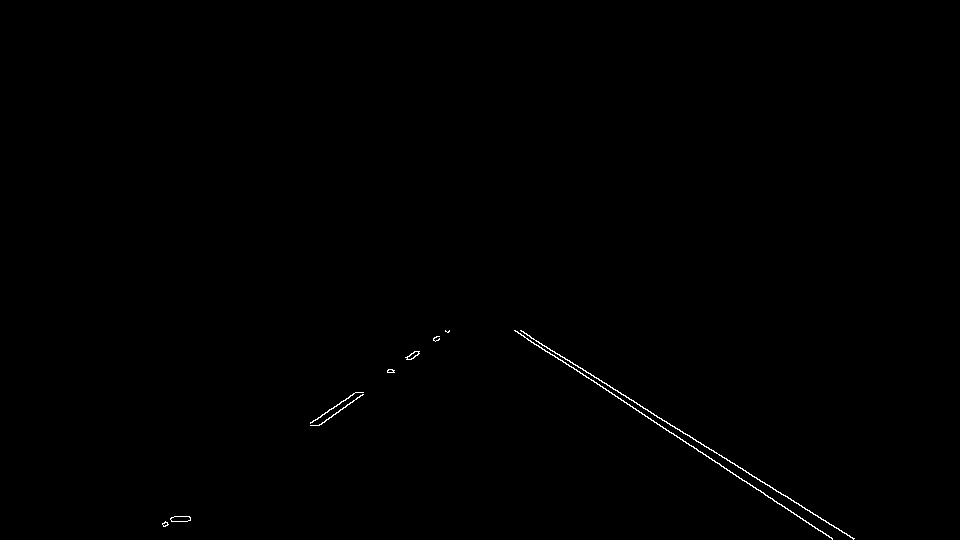
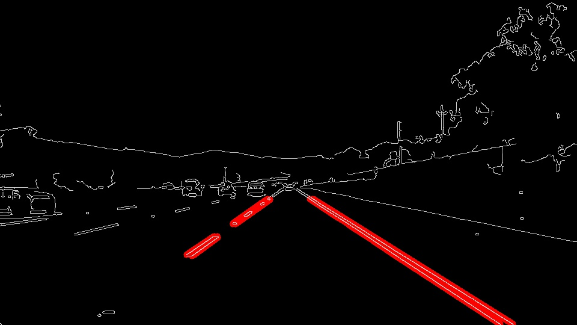

# **Finding Lane Lines on the Road** 

## Reflection

### 1. Description of pipeline

My pipeline as implemented in `process_image(image)` consists of 6 steps: 
1. In `apply_grayscale(image)` the original image is converted to grayscale.

2. In `apply_gaussian(image, kernel_size)` a Gaussian blur is applied. Remark: This step is optional, as `cv2.Canny()` applies a 5x5 Gaussian internally. 

3. In `apply_canny_edge(image, low_threshold, high_threshold)` the edges of the image are detected using Canny edge detection. 

4. In `mask(image, min_x_left, max_x_left, min_x_right, max_x_right, min_y, max_y, ignore_mask_color)` a polygon mask corresponding to the region of interest is applied to the image. It is crucial to select a "good" region of interest. A region of interest that is too small will keep valuable information from being used by the Hough transformation. This leads to inferior results particularly in the case of dashed lane markings. If curvatures are present, a region of interest that is too large will take into account the curved lane markings at the upper border of the region of interest. This will lead to inferior results as these lane markings will negatively affect the average of all lines detected by the Hough transformation. 

5. In `calculate_hough_transform(image, rho, theta, threshold, min_line_length, max_line_gap` the Hough transform is calculated and in `apply_hough_transform(image, original, lines)` it is applied to the image. In particular the parameters `threshold`, `min_line_length` and `max_line_gap` influence the quality of the result obtained. I assume, that there is a variety of parameter combinations that yield satisfactory results. When applied to the two videos, the parameters I chose produce somewhat more "jumpy" lines than the lines in the example solutions. I have the feeling however, that my lines are a little bit more "accurate" that the lines in the example solutions. 

6. In `separate_lane_boundaries(lines)` the set of lines as obtained from the previous step is separated into 3 sets according to the respective slope of the line: A set of lines that is part of the right lane boundary (slope > 0.5), a set of lines that is part of the left lane boundary (slope < -0.5) and a set of nearly horizontal lines that is ignored (|slope| < 0.5). In `calculate_polynomial(lines)` the median of all lines belonging to a lane boundary is calculated. This is done by passing the start and end points of all lines to the `numpy.polyfit()` function, which then fits a polynomial of degree 1 to these points and returns the vector of coefficients that minimises the squared error. In my pipeline, x and y coordinates are passed to the function in iverse order and thus the inverse polynomial is obtained. The inverse definition is helpful later when `y_start` and `y_end` of the line to be drawn are known but the corresponding`x_start` and `x_end` are unknown. In general, one could use a more sophisticated way of averaging the lines, e.g. use the lenghts of the lines to calculate some sort of weighted average and thus give longer lines a higher weight than shorter lines. This might also lead to less "jumpy" lines in the videos. However, the simple approach as described above already yields satisfactory results. Finally, in `draw_lines(image, (f_right, f_left), y_start, y_end)` the obtained lines corresponding with the left and right lane boundaries are drawn on the original image.

### 2. Potential shortcomings with the current pipeline

As mentioned in section 1, the selection of the region of interest is crucial. With a static region of interest it is therefore wise to think about situations where the region of interest is exptected to be different. Such situations could be: stronger curvatures on highways, urban situations, situations with denser traffic, uphill/downhill streets, etc. In these cases it might be necessary to implement a dynamic region of interest. Some parameters for this could be derived from other sensors of the vehicle (map, position sensor, etc.).

Another shortcoming could be that the canny edge detection alone and with its current parameterization might not be sufficient in situations with difficult light conditions, e.g. during night time, with backlight or when shadows from trees or other roadside structures are present. Additional image processing steps might be necessary such as reducing the image contrast, etc.

### 3. Possible improvements

As mentioned in section 1, a possible improvement in step 6 of the pipeline would be to try a more sophisticated way of averaging the lines, e.g. to use the lenghts of the lines to calculate some sort of weighted average and thus give longer lines a higher weight than shorter lines. I expect that for a series of similar pictures (i.e. a video), the longer lines that are found by applying a Hough transformation in particular would be similar across neighboring pictures while some other shorter lines at the borders of the region of interest might vary significantly. Implementing this improvement might therefore lead to less "jumpy" lines in the videos.

Furthermore, it would of course make sense to test the current implementation with the corner cases as mentioned in section 2 and implemenent whatever improvements might become necessary, e.g. a dynamic selection of the region of interest or additional steps in the image processing pipeline to account for situations with difficult light situations.
